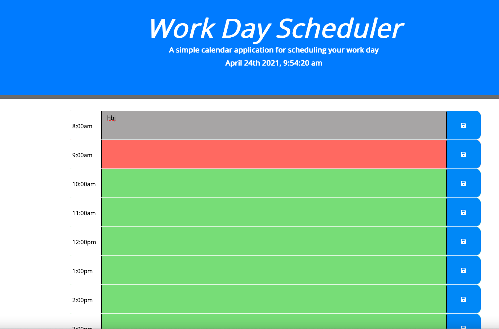
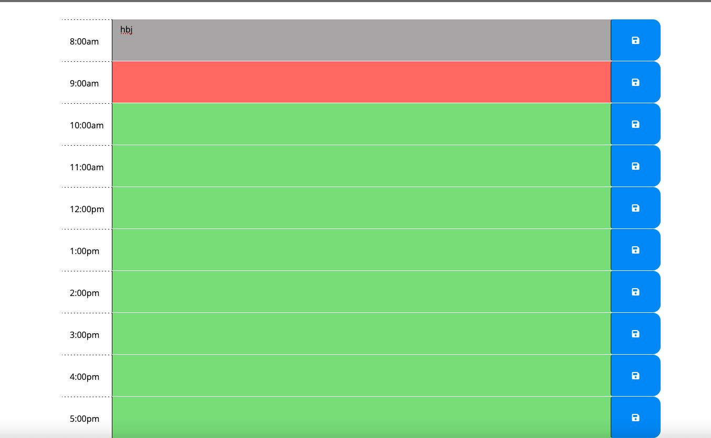

# 05 Third-Party APIs: Work Day Scheduler

## Your Task

Created a simple calendar application that allows a user to save events for each hour of the day by modifying starter code. This app will run in the browser and feature dynamically updated HTML and CSS powered by jQuery.

You'll need to use the [Moment.js](https://momentjs.com/) library to work with date and time. Be sure to read the documentation carefully and concentrate on using Moment.js in the browser.

## User Story

```md
AS AN employee with a busy schedule
I WANT to add important events to a daily planner
SO THAT I can manage my time effectively
```

## Acceptance Criteria
# 

# 

# 
## Contributors
[Gurjant Riarl](https://github.com/GurjantRiar/workscheduler/
)

# 
## Built With:
[Visual Studio](https://visualstudio.microsoft.com/)

[CSS](https://www.w3.org/TR/CSS/#css)


# 
## Links:
[Email](riargurjant_85@yahoo.com)

[Github Profile](https://github.com/GurjantRiar/
)


